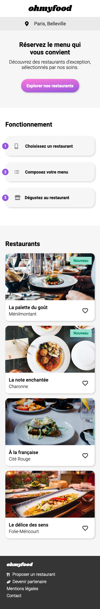
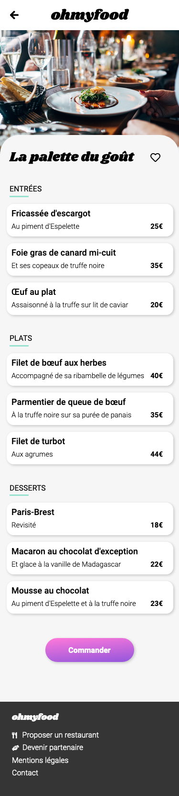

# ohmyfood

Projet n°3 du [parcours Développeur Web](https://openclassrooms.com/fr/paths/556-developpeur-web#path-tabs) d'OpenClassrooms : _Dynamisez une page web avec des animations CSS_.

> Il s'agit d'intégrer les maquettes fournies avec des animations CSS spécifiées et un loader. On travaille ici en mobile first.

## 📚 Technologie utilisées

- HTML
- CSS
- Sass
- Icônes FontAwesome

## 📎 Rendu visuel

## 💻 Démo du site

[ohmyfood](https://clementstorne.github.io/ohmyfood/)
